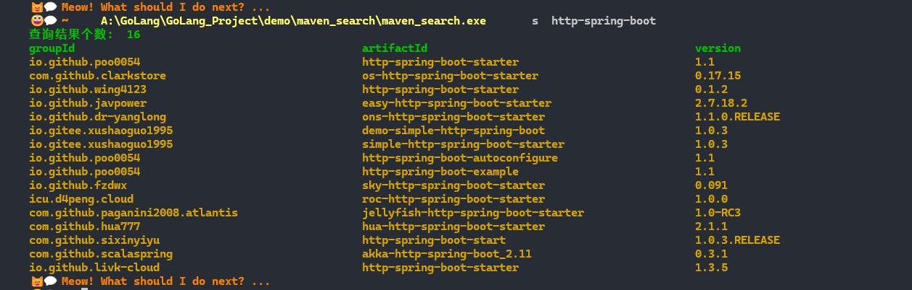
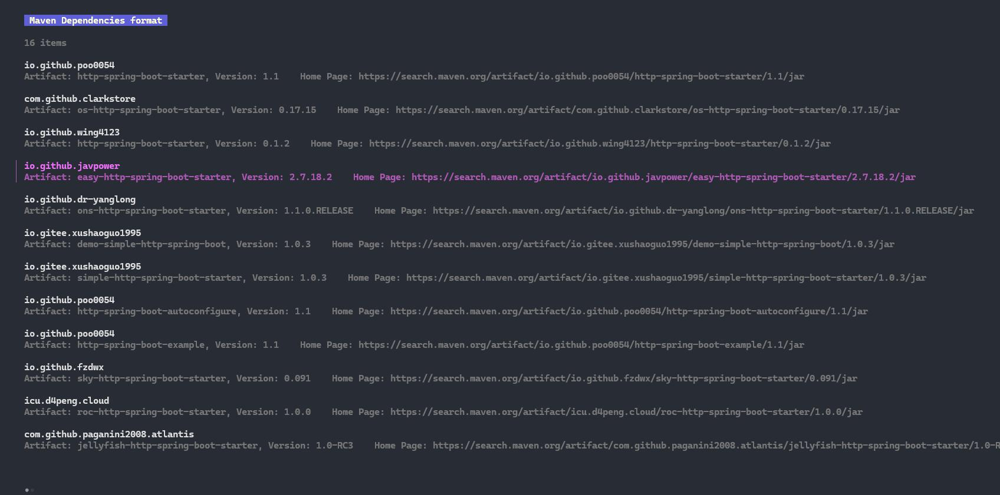

# go_tools

面向 Windows 场景的一组小型 Go CLI：在终端渲染图片、清理无效快捷方式、批量解压目录、查询 Maven 仓库依赖。

## 快速开始
- 前置：Go 1.20+，Windows 终端需要支持 24-bit TrueColor（Windows Terminal/新版 PowerShell）。
- 全量构建：`just build`（或按下述命令分别构建各工具）。
- 运行示例：仓库根目录下的 `cat.jpg` 可用于快速验证 `imgcat`。

## 工具一览

### imgcat (`cmd/imgcat`)
- 用 ANSI TrueColor 在终端显示 PNG/JPEG/GIF/BMP，支持 GIF 循环播放。
- 构建：`go build -ldflags="-w -s" ./cmd/imgcat`
- 用法：`imgcat [-interpolation lanczos|nearest] [-type fit|resize] [-top-offset N] [-silent true] <image> <dummy>`
  - 当前实现需要至少两个位置参数，第二个参数会被忽略。
  - 示例：`imgcat -type fit cat.jpg placeholder`
- 交互：GIF 播放时按 `Ctrl+C` 退出；`-silent true` 可隐藏退出提示行。

### clearlnk (`cmd/clearlnk`)
- Windows 下扫描桌面/开始菜单/任务栏等常见位置的 `.lnk`，列出目标丢失或损坏的快捷方式。
- 构建：`go build -tags clearlnk -ldflags="-w -s" ./cmd/clearlnk`
- 用法：`clearlnk`（直接输出异常快捷方式路径与原因）。

### dir_extract (`exc`)
- 批量解压目录中的压缩包（zip/7z/rar/gz/xz…），可选解压后删除源压缩包；优先使用 `go-unarr`，失败时回退到本机 `7z`。
- 构建：`go -C exc build -ldflags="-w -s" .`（二进制名默认为 `dir_extract`）
- 用法：
  - `dir_extract <dir>` 解压指定目录下所有压缩包
  - `dir_extract -r <dir>` 解压后删除原压缩包

### maven_search (`maven_search`)
- CLI/TUI 查询 https://search.maven.org，支持以 Maven/Gradle 依赖格式输出并在列表中选择版本。
- 构建：`go -C maven_search build -ldflags="-w -s" .`
- 用法：
  - `maven_search search spring-boot` 列出匹配包
  - `maven_search search -m spring-boot` 选择版本后输出 Maven `<dependency>`
  - `maven_search search -g spring-boot` 选择版本后输出 Gradle 依赖
- 截图：`maven_search/img/search.jpg`、`maven_search/img/TUI.jpg`

 

###  screenshot 

--- 

